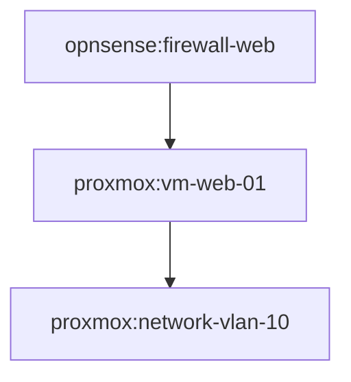

# Visualizing Infrastructure Topology

InfraFoundry creates a sophisticated dependency graph of your infrastructure resources to determine the correct order for planning, applying, and destroying resources. You can visualize this graph to understand relationships and debug dependencies.

## Usage

Use the `infra graph` command to generate a visualization:

```bash
# Generate a Mermaid diagram for the 'dev' environment
infra graph --env dev
```

The output is a Mermaid diagram definition that can be rendered by tools like [Mermaid Live Editor](https://mermaid.live) or embedded in Markdown documentation on GitHub/GitLab.

## Graph Structure

### Nodes
Nodes represent individual resources managed by InfraFoundry. They are labeled with their full provider-scoped name:
*   `proxmox:vm-01`
*   `opnsense:firewall-rule-100`
*   `kubernetes:deployment-web`

### Edges (Arrows)
Arrows represent dependencies. An arrow from **A --> B** means **A depends on B**.
*   **Creation Order:** B must be created *before* A.
*   **Deletion Order:** A must be destroyed *before* B.

## Example Output



In this example:
1.  The VM `vm-web-01` depends on the network `vlan-10`.
2.  The firewall rule `firewall-web` depends on the VM `vm-web-01` (perhaps needing its IP address).

## Dependency Sources

Dependencies are automatically calculated from:
1.  **Provider Rules:** Providers define implicit dependencies (e.g., a VM depends on its network interface).
2.  **References:** When one resource references another by name in its configuration.
3.  **Explicit `depends_on`:** (Future) Explicit dependency declaration in YAML.
