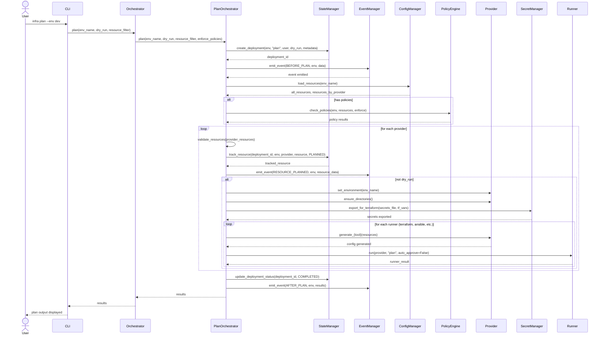
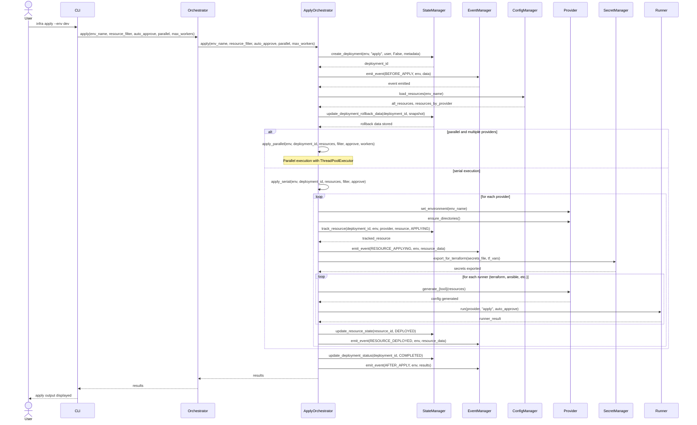
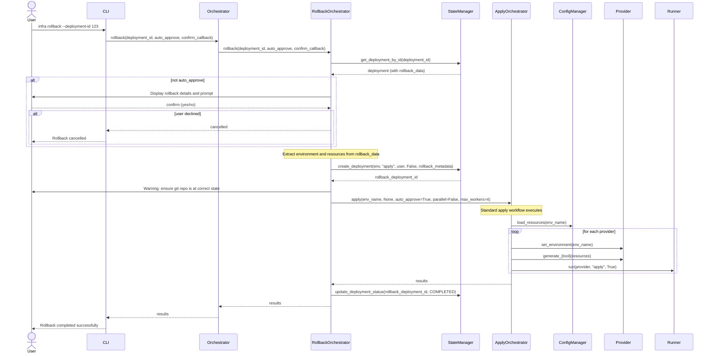

# Orchestrator Architecture

## Overview

The Orchestrator is a thin coordinator that wires providers, runners, policy checks, drift detection, state, events, and notifications. Dedicated workflow classes handle plan/apply/destroy/rollback/status while the Orchestrator focuses on delegation and ordering.

## Audience and Prerequisites

- **Audience:** Contributors extending orchestration workflows or debugging execution order.
- **Prereqs:** Understanding of InfraFoundry providers, runners, and state/event systems.

## When to Use This

- Tracing how plan/apply/destroy invoke helpers.
- Adding new workflow steps or hooks.
- Ensuring providers are registered and grouped correctly.

## Quick Start

1. Run a workflow to see orchestration in action:
   ```bash
   infra plan --env dev
   infra apply --env dev
   infra destroy --env dev
   ```
2. Inspect generated artifacts and events to verify order and outputs.

## Architecture Details

- **Delegation pattern:** Top-level Orchestrator is a facade; workflow classes (`Validation/Plan/Apply/Destroy/Rollback/Drift/Status` orchestrators in `core/orchestrator_workflows.py`) implement steps.
- **Helpers coordinated:**
  - ConfigManager (resource loading/validation)
  - PolicyEngine (pre-deployment checks)
  - Dependency graph builder (ordering)
  - SecretManager (exports for Terraform/Ansible)
  - Providers (render Terraform/Ansible)
  - Runners via DeploymentExecutor (Terraform/Ansible execution)
  - StateManager (deployments/resources/events)
  - EventManager (BEFORE/AFTER/FAILED events across lifecycle)
  - NotificationManager (subscribed to events)
- **Workflow outline:**
  1. Create deployment record; emit BEFORE event.
  2. Load/validate resources; check policies; group by provider.
  3. Track resources in state; render Terraform/Ansible; export secrets.
  4. Execute via runners; update state; emit AFTER or FAILED events.
- **Provider registry:** Providers registered once; grouped resources dispatched per provider.

## Workflow Sequence Diagrams

The following sequence diagrams illustrate the interaction flow between components during key workflows.

### Plan Workflow



### Apply Workflow



### Rollback Workflow



## Validation and Checks

- Use `infra validate --env <env> --check-api --check-refs` before workflows.
- Check state updates with `infra history`/`infra status`.
- Review event emissions (notifications/logs) to ensure hooks fire.

## Examples

- **Dependency grouping concept:**
  ```python
  resources_by_provider = group_resources(resources)
  for provider_name, items in resources_by_provider.items():
      provider = providers[provider_name]
      provider.generate_terraform(items)
      deployment_executor.execute(provider_name, items)
  ```
- **Event emission concept:**
  ```python
  event_manager.emit_event(EventType.BEFORE_APPLY, environment=env, data={...})
  ```

## Related Documentation

- [Infrastructure Architecture](ARCHITECTURE.md)
- [Pluggable Runners](pluggable-runners.md)
- [Architecture Overview](overview.md)
- [State Management](state-management.md)
- [Notifications Guide](../configuration/notifications.md)

## Troubleshooting

- **Symptom:** Providers not executed. **Fix:** Ensure provider registration and resource grouping; check resource `provider` fields.
- **Symptom:** Events/notifications missing. **Fix:** Verify subscribers are registered; run with higher log level.
- **Symptom:** State not updated. **Fix:** Confirm database backend connectivity and that workflow calls StateManager methods.

---

Last updated: 2025-12-02


---
[Back to Table of Contents](../TABLE_OF_CONTENTS.md)
